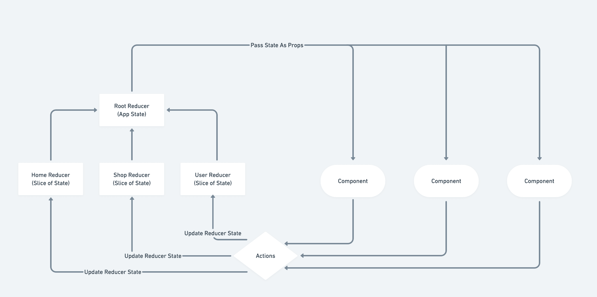

<a id="top">TABLE OF CONENTS</a>
1. [REACT CORE CONCEPTS](#link0)
2. [REACT CONCEPTS](#link1)
3. [REACT TOOLS](#link3)
4. [REACT ECOSYSTEM](#link4)
   1. [Redux](#link41)
   2. [React Router](#link42)
   3. [Firebase](#link43)
   4. [Stripe](#link44)
   5. [CSS in JS](#link45)
   6. [GraphQL](#link46)
   7. [React Mobile](#link47)
   8. [Gatsby](#link48)
5. [REACT PATTERNS](#link5)
6. [REACT ARCHITECTURE](#link6)
7. [REACT PERFORMANCE](#link7)
8. [REACT PROJECTS](#link8)
9.  [REACT EXTRA](#link9)
  
---
## <a id="link0"></a> 1.REACT CORE CONCEPTS
[[back to top]](#top)

### Declarative vs Imperative
> Changes in the DOM are made by React not you
> 
> **Imperative**: you change the DOM
>   - repaint, and reflow are the most expensive operations regarding DOM changes
> 
> **Declarative**: you describe the changes (by using state)

### Component Architecture
> Like lego blocks

### One Way Data Flow
> Data never move up
> 
> Data is only **moving down**

### Hooks

#### Resources:
- Andrei Hooks: https://www.udemy.com/course/complete-react-developer-zero-to-mastery/learn/lecture/15237486#questions
- Andrei Context: https://www.udemy.com/course/complete-react-developer-zero-to-mastery/learn/lecture/15491558#questions
---

## <a id="link1"></a> 2.REACT CONCEPTS
[[back to top]](#top)

### Lifecycles

#### **MOUNTING**
> 
> The component is inserted into the DOM for the firt time
> 
> Calling **super()** inside constructor is giving us all the functionality for what our class is extendng 
> 
> **1.Constructor**
> - here we initialize state
>
> **2.Render()**
> - getting and evaluating the props we are receiving
>
> **3.ComponentDidMount()**
> - once we are mounting the component this lifecycle method is called
> - good for making api calls


#### **UPDATING**
> 
> - receiving new state, new props, or using forceUpdate() is causing our component to be re-rendered
> 
> **1.ShouldComponentUpdate(nextProps, nextState)**
> 
> **2.Render()**
> 
> **3.ComponentDidUpdate()**


#### **UNMOUTING**
> 
>**1.ComponentWillUnmount()**
> - cleanup work

#### Resources:
- Lifecycle Methods Diagram: https://projects.wojtekmaj.pl/react-lifecycle-methods-diagram/
- React Local Storage Persist: https://www.udemy.com/course/complete-react-developer-zero-to-mastery/learn/lecture/15173014#questions
- React HOC: https://www.udemy.com/course/complete-react-developer-zero-to-mastery/learn/lecture/15243938#questions
---

## <a id="link3"></a> 4.REACT TOOLS
[[back to top]](#top)

### Boilerplates

> If you want to run create react app as a PWA
> 
> `npx create-react-app crwn-clothing --template cra-template-pwa`

#### Resources:
---

## <a id="link4"></a> 5.REACT ECOSYSTEM
[[back to top]](#top)

### <a id="link41"></a> Redux
[(back to top)](#top)

#### **REDUX MAIN CONCEPTS**
> **1. Single source of truth** 
> - One single big object that describes the entire state of the app
>
> **2.State is read only**
> - Create a new state after each action emitted by the user
> 
> **3. Changes using pure functions**

#### **REDUX FLOW**


> **Action**
>  - something a user does (button click)
> 
> **Root Reducer**
>  - then the action goes to reducer
>  - recevies an input (the action)
>  - creates an output (the state/store)
> 
> **Store -> DOM Changes**

#### **ASYNC REDUX**
> **Observable Pattern**
> 
> **Promise Pattern**
> 
> **Redux Thunk**
> 
> **Redux Saga**

#### **TIPS**
> Store shop data in an object, not in an array - better performance

#### **TOOLS**
> **redux-presist** -> for local storage

#### Resources:
- Andrei Redux: https://www.udemy.com/course/complete-react-developer-zero-to-mastery/learn/lecture/15160420#questions
- Andrei Observable Pattern: https://www.udemy.com/course/complete-react-developer-zero-to-mastery/learn/lecture/15196980#questions
- Andrei Promise Pattern: https://www.udemy.com/course/complete-react-developer-zero-to-mastery/learn/lecture/15197284#questions
- Adnrei Thunk: https://www.udemy.com/course/complete-react-developer-zero-to-mastery/learn/lecture/15203964#questions
- Adnrei Thunk: https://www.udemy.com/course/complete-react-developer-zero-to-mastery/learn/lecture/15203964#questions
- Adnrei Saga: https://www.udemy.com/course/complete-react-developer-zero-to-mastery/learn/lecture/15221988#questions

### <a id="link42"></a> React Router
[(back to top)](#top)

#### Resources:
- Andrei Router: https://www.udemy.com/course/complete-react-developer-zero-to-mastery/learn/lecture/14974356#questions
- Andrei Nested Router: https://www.udemy.com/course/complete-react-developer-zero-to-mastery/learn/lecture/15175184#questions
- Docs: https://reactrouter.com/web/guides/quick-start

### <a id="link43"></a> Firebase
[(back to top)](#top)

#### Resources:
- Andrei Auth: https://www.udemy.com/course/complete-react-developer-zero-to-mastery/learn/lecture/15147270#questions
- Andrei Redux: https://www.udemy.com/course/complete-react-developer-zero-to-mastery/learn/lecture/15188186#questions
- Andrei Security: https://www.udemy.com/course/complete-react-developer-zero-to-mastery/learn/lecture/16037152#questions

### <a id="link44"></a> Stripe
[(back to top)](#top)

#### Resources:
- Andrei Stripe: https://www.udemy.com/course/complete-react-developer-zero-to-mastery/learn/lecture/15336078#questions
- Andrei Stripe Backend: https://www.udemy.com/course/complete-react-developer-zero-to-mastery/learn/lecture/15254700#questions

### <a id="link45"></a> CSS in JS
[(back to top)](#top)

#### Resources:
- Andrei: https://www.udemy.com/course/complete-react-developer-zero-to-mastery/learn/lecture/15185624#questions

### <a id="link46"></a> GraphQL + Apollo
[(back to top)](#top)

#### Resources:
- Andrei: https://www.udemy.com/course/complete-react-developer-zero-to-mastery/learn/lecture/15351934#questions

### <a id="link47"></a> React Mobile
[(back to top)](#top)

#### Resources:
- Andrei: https://www.udemy.com/course/complete-react-developer-zero-to-mastery/learn/lecture/15380282#questions

### <a id="link48"></a> Gatsby
[(back to top)](#top)

#### Resources:
- Andrei: https://www.udemy.com/course/complete-react-developer-zero-to-mastery/learn/lecture/15405956#questions

---


## <a id="link5"></a> 6.REACT PATTERNS AND BEST PRACTICES
[back to top](#top)

#### **HOW TO BE A GOOD REACT DEV**
> 
> Decide on components
> 
> Decide the state and where it lives
> 
> What changes when state changes

#### **ASYNC SETSTATE:**
```javascript
handleClick = () => {
    // setState it will be called in the future, meanwhile clg is called immediately
    // we use the object syntax when we don't use the state object to update the value
    // e.g. this.setState({ counter: 'test' })
    this.setState({ counter: this.state.counter + 1 }); // 1
    console.log(this.state.counter);                    // 0 

    // fix - but is bad practice
    this.setState({ counter: this.state.counter + 1 }),
    () => console.log(this.state.counter)); // 1

    // fix 
    this.setState((prevState, prevProps) => ({ counter: prevState.counter + 1 }),
    () => console.log(this.state.counter)); // 1
}   
```

#### **DATA NORMALIZATION:**

> The concept of storing lists of elements inside of an object instead of an array is called **DATA NORMALIZATION**

#### Resources:
- Hash vs Arrays: https://www.kirupa.com/html5/hashtables_vs_arrays.htm 
- State Normalization: https://www.udemy.com/course/complete-react-developer-zero-to-mastery/learn/lecture/15176016#questions
- Container Pattern: https://www.udemy.com/course/complete-react-developer-zero-to-mastery/learn/lecture/15221888#questions
---

## <a id="link6"></a> 7.REACT ARCHITECTURE
[back to top](#top)

#### Resources:
---

## <a id="link7"></a> 8.REACT PERFORMANCE
[back to top](#top)

#### Resources:
- Andrei: https://www.udemy.com/course/complete-react-developer-zero-to-mastery/learn/lecture/15381662#questions
---

## <a id="link8"></a> 9.REACT PROJECTS
[back to top](#top)

#### Resources:
---

## <a id="link9"></a> REACT EXTRA
[back to top](#top)

#### Resources:
- Andrei React Course: https://www.udemy.com/course/complete-react-developer-zero-to-mastery/learn/lecture/14754858#questions
- Andrei React Interview: https://www.udemy.com/course/complete-react-developer-zero-to-mastery/learn/lecture/15104118#questions
- Interview Questions: https://github.com/sudheerj/reactjs-interview-questions
---